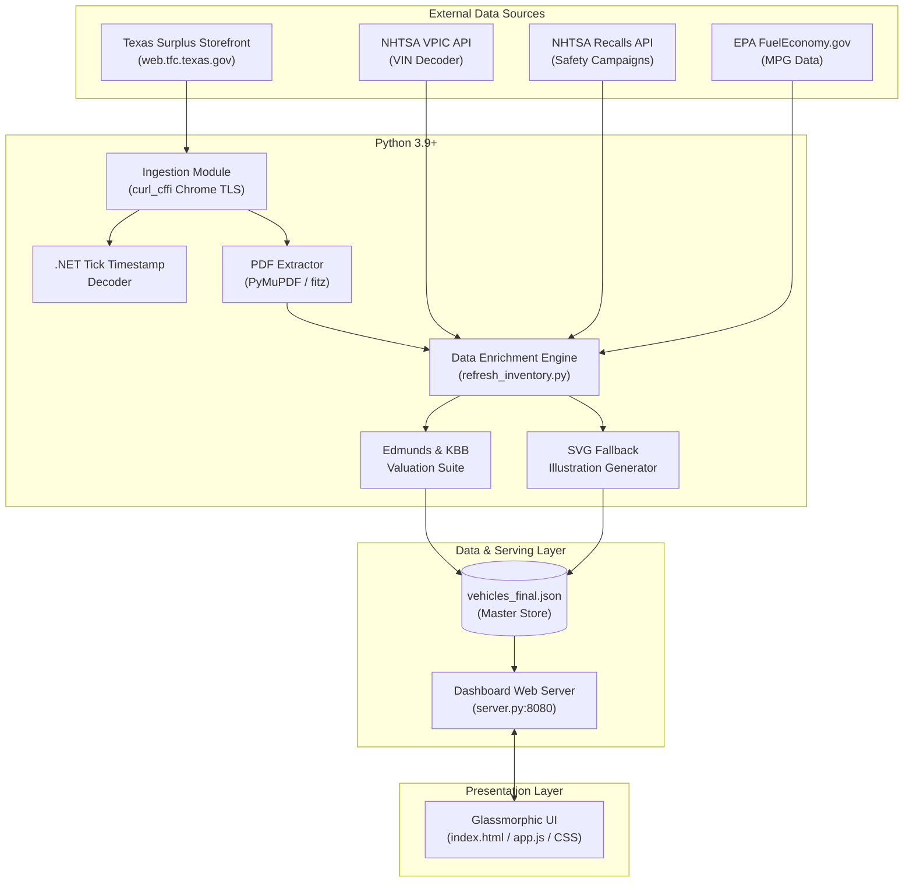
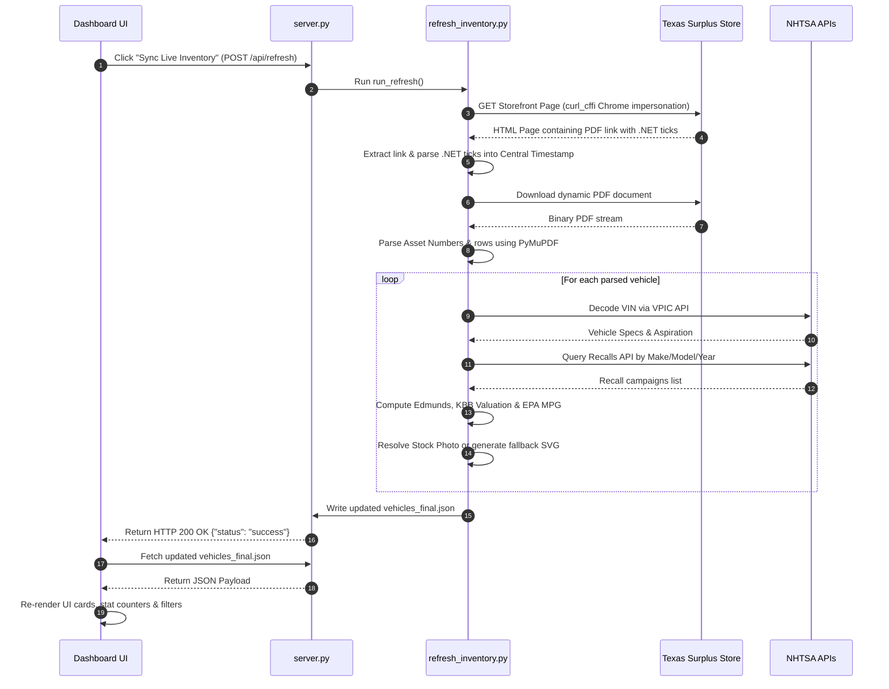

# 📐 System Design Document: Texas State Surplus Vehicles Inventory Tracker & Dashboard

**Author:** Antigravity AI  
**Project Workspace:** `/Users/slemay/Work/Surplus`  
**Date:** August 10, 2026  
**Status:** Approved / Active Production Architecture  

---

## 1. Executive Summary

The **Texas State Surplus Vehicles Inventory Tracker & Dashboard** is an end-to-end automated data pipeline, enrichment engine, and web presentation platform designed to monitor, augment, and visualize government surplus vehicle listings from the **Texas State Surplus Store** (Texas Facilities Commission - TFC).

By combining browser TLS impersonation, PDF document parsing, external API enrichments (NHTSA VIN Decoder, NHTSA Safety Recalls, EPA Fuel Economy), and algorithmic market valuation modeling (Edmunds & KBB metrics), the system transforms raw PDF table rows into a searchable, interactive, glassmorphic analytics dashboard.

---

## 2. Problem Statement & Objectives

### 2.1 Technical Challenges
1. **Akamai WAF Blocking**: TFC storefront servers enforce strict Akamai Edge Web Application Firewall rules, rejecting standard HTTP scrapers with `403 Forbidden` responses.
2. **Dynamic File URIs**: Vehicle inventory PDFs are served via dynamic `.NET` publication endpoints (`/home/showpublisheddocument/232/{ticks}`) where `{ticks}` is a 64-bit timestamp updated unpredictably.
3. **Unstructured & Sparse Data**: Raw PDF documents contain minimal vehicle details—only Asset Number, raw description, VIN, mileage, and sales price—lacking engine specs, safety history, market values, or photos.

### 2.2 System Objectives
- **Automated Ingestion**: Bypass WAF protections using Chrome TLS fingerprinting to dynamically extract current PDF URLs and decode document timestamps into Central Time.
- **Deep VIN & Safety Intelligence**: Query NHTSA APIs to decode engine displacement, horsepower, drivetrain, assembly location, aspiration (Naturally Aspirated vs Turbocharged), and open safety recalls.
- **Automated Market Valuation**: Estimate Kelley Blue Book (KBB) Fair Purchase Values and Edmunds expert reviews based on vehicle year, mileage, condition, and market baseline curves.
- **Adaptive Visual Assets**: Serve high-resolution studio stock photos for known models and automatically render custom vector SVG illustrations for newly listed models.
- **Interactive Web Interface**: Provide a modern, dark-mode glassmorphic UI with real-time fuzzy search, multi-select filters, sorting, stat counters, and single-click live synchronization.

---

## 3. High-Level System Architecture



---

## 4. Module & Component Specifications

### 4.1 Ingestion & WAF Bypass Module (`pull_surplus_vehicles.py` & `refresh_inventory.py`)
- **Technology**: `curl_cffi` (impersonating `chrome127`), `BeautifulSoup4`.
- **Mechanism**:
  - Executes TLS handshake with exact JA3/JA4 fingerprints matching Google Chrome to prevent Akamai WAF TCP/TLS signature mismatch drops.
  - Scrapes `https://web.tfc.texas.gov/public/state-surplus-store` for `<a>` tags matching *"list of vehicles for sale at the State Surplus Store"*.
  - Extracts the dynamic document URI containing a 64-bit `.NET` tick timestamp (e.g. `638843916000000000`).

#### .NET Tick Timestamp Decoding Algorithm
$$.NET\ Epoch = \text{January 1, 0001 00:00:00 UTC} = 621,355,968,000,000,000\ \text{ticks}$$
$$\text{Unix Epoch Seconds} = \frac{\text{Ticks} - 621355968000000000}{10,000,000}$$
Converted to UTC ISO 8601 string and localized to `America/Chicago` timezone for display.

### 4.2 PDF Parsing & Structuring Layer (`PyMuPDF / fitz`)
- Opens downloaded binary stream `Texas_State_Surplus_Vehicles.pdf`.
- Scans textual content using regex identifier for State Surplus Asset Numbers:
  $$\text{Asset Pattern} = \verb|^|\backslash\text{d}\{3\}-\backslash\text{d}\{6\}-\backslash\text{d}\{2\}-\backslash\text{d}\{3\}\verb|$|$$
- Parses consecutive token blocks: `[Asset Number, Description, VIN, Mileage, Sales Price]`.

### 4.3 VIN Decoding & Safety Enrichment Module
- **NHTSA VPIC API Endpoint**: `https://vpic.nhtsa.dot.gov/api/vehicles/decodevinvalues/{VIN}?format=json`
  - Extracts: `Make`, `Model`, `ModelYear`, `BodyClass`, `EngineCylinders`, `DisplacementL`, `EngineHP`, `DriveType`, `PlantCity`, `PlantState`.
  - Determines **Engine Aspiration**: Checks `Turbo` and `Supercharger` flags to classify as *Turbocharged*, *Supercharged*, or *Standard (Naturally Aspirated)*.
- **NHTSA Recalls API Endpoint**: `https://api.nhtsa.gov/recalls/recallsByVehicle?make={Make}&model={Model}&modelYear={Year}&format=json`
  - Maps active campaigns, defect components, safety consequences, and manufacturer remedy procedures.

### 4.4 Market Valuation Engine
Calculates Kelley Blue Book (KBB) Fair Market Purchase Values dynamically based on model year, baseline depreciation rates, and surplus vehicle mileage relative to industry averages (160,000 miles standard threshold):

$$\text{Mileage Delta} = 160,000 - \text{Vehicle Mileage}$$
$$\text{Mileage Adjustment} = \text{Mileage Delta} \times 0.035$$
$$\text{KBB Fair Price} = \max\left(\$4,000, \text{KBB Base} + \text{Year Adj} + \text{Mileage Adj}\right)$$
$$\text{Savings Vs Surplus} = \max\left(0, \text{KBB Fair Price} - \text{Surplus Sales Price}\right)$$

### 4.5 Fallback SVG Vector Illustration Generator
When a newly ingested vehicle model lacks a static studio photograph in `/images/`, `refresh_inventory.py` automatically generates a clean, styled SVG blueprint illustration containing:
- Brand-tailored accent colors (Ford `#0284c7`, Chevy `#d97706`, RAM `#dc2626`).
- Vector car silhouette graphics with tire stroke paths.
- Rendered text overlays for Model Year, Make, Model, and Surplus watermark.

### 4.6 Server & API Layer (`server.py`)
- **Base Class**: `http.server.SimpleHTTPRequestHandler`
- **Port**: `8080` (with `SO_REUSEADDR` socket option enabled).
- **CORS & Cache Controls**:
  - `Access-Control-Allow-Origin: *`
  - `Cache-Control: no-cache, no-store, must-revalidate`
- **Endpoints**:
  - `GET /*`: Serves static web dashboard assets (`index.html`, `styles.css`, `app.js`, images, JSON).
  - `POST /api/refresh`: Executes `refresh_inventory.run_refresh()` synchronously, returning JSON status.

### 4.7 Frontend Presentation Layer (`index.html`, `styles.css`, `app.js`)
- **Design System**: Dark-mode glassmorphism (`backdrop-filter: blur(16px)`, HSL color palette, smooth transitions).
- **State Management**: Reactive state store tracking `vehicles`, `activeSearchQuery`, `selectedMakes`, `selectedBodyStyles`, `activeSortOption`.
- **Components**:
  - Hero Header with live update timestamp.
  - Stat KPI cards (Total Fleet Count, Average Price, Lowest Price, Recalls Tracked).
  - Filter drawer & search bar with instant client-side filtering.
  - Responsive Grid layout for vehicle listing cards.
  - Slide-in Modal Drawer for detailed VIN specifications, KBB valuation breakdowns, and recall campaign accordions.

---

## 5. Data Schemas & Models

### 5.1 `vehicles_final.json` Schema

```json
{
  "generatedAt": {
    "ticks": "638843916000000000",
    "docUrl": "https://web.tfc.texas.gov/home/showpublisheddocument/232/638843916000000000",
    "isoUtc": "2026-08-10T12:00:00+00:00",
    "formattedCentral": "August 10, 2026 at 07:00 AM CDT",
    "formattedShort": "Aug 10, 2026, 07:00 AM",
    "dateOnly": "August 10, 2026"
  },
  "vehicles": [
    {
      "assetNumber": "303-602958-20-001",
      "description": "2018 CHEVROLET SILVERADO 1500 PICKUP",
      "vin": "3GCUKNEC3JG398300",
      "mileage": 142105,
      "salesPrice": 12500.0,
      "specs": {
        "Make": "CHEVROLET",
        "Model": "Silverado 1500",
        "ModelYear": "2018",
        "BodyClass": "Pickup",
        "EngineCylinders": "8",
        "DisplacementL": "5.3",
        "EngineHP": "355",
        "FuelTypePrimary": "Gasoline",
        "DriveType": "4WD/Four-Wheel Drive",
        "PlantCity": "SILAO",
        "PlantState": "GUANAJUATO",
        "PlantCountry": "MEXICO",
        "VehicleType": "TRUCK",
        "Manufacturer": "GENERAL MOTORS LLC",
        "Trim": "LT",
        "Series": "1500",
        "Aspiration": "Standard"
      },
      "recalls": {
        "count": 2,
        "items": [
          {
            "campaignNumber": "19V761000",
            "component": "SERVICE BRAKES, HYDRAULIC:ELECTRONIC STABILITY CONTROL",
            "summary": "Software defect in brake control module...",
            "consequence": "Unexpected braking behavior may increase crash risk.",
            "remedy": "Dealers will reprogram the brake control module free of charge.",
            "date": "10/24/2019"
          }
        ]
      },
      "mpg": {
        "city": 16,
        "hwy": 22,
        "combined": 18
      },
      "image": "images/chevrolet_silverado.jpg",
      "edmundsReview": {
        "rating": 4.5,
        "ratingText": "Edmunds Rating: 4.5 / 5 - Outstanding",
        "summary": "The 2018 Silverado 1500 Crew Cab 4x4 is celebrated for its powerful 5.3L V8...",
        "pros": ["Quiet cabin", "Strong 5.3L V8"],
        "cons": ["Hesitant downshifts"],
        "verdict": "A powerhouse 4x4 pickup truck.",
        "url": "https://www.edmunds.com/chevrolet/silverado-1500/2018/review/"
      },
      "kbbValuation": {
        "fairPurchasePrice": 20126,
        "formattedFairPrice": "$20,126",
        "priceRange": "$17,710 - $22,541",
        "privatePartyValue": 18515,
        "suggestedRetail": 22138,
        "savingsVsKbb": 7626,
        "savingsPct": 37.9,
        "formattedSavings": "$7,626",
        "url": "https://www.kbb.com/chevrolet/silverado-1500-crew-cab/2018/"
      }
    }
  ]
}
```

---

## 6. End-to-End Sequence Workflow



---

## 7. Security, Reliability & Compliance

1. **WAF Compliance & Rate Limiting**: The scraper operates on-demand or on reasonable schedule intervals, including a `time.sleep(0.1)` delay between VIN enrichment calls to respect NHTSA API rate limits.
2. **CORS & Caching Isolation**: `server.py` sends strict `Cache-Control: no-cache, no-store, must-revalidate` headers to prevent stale vehicle inventory or missing image assets from persisting in client browser caches.
3. **Graceful Fallbacks**: If NHTSA APIs experience downtime or network latency, the pipeline defaults `specs`, `recalls`, and `mpg` to safe empty fallbacks without failing the main inventory refresh.

---

## 8. Deployment & Operational Verification

### Verification Checklist
- [x] Run `server.py` via virtual environment (`./venv/bin/python3 server.py`).
- [x] Verify HTTP 200 responses for static files (`http://localhost:8080/index.html`).
- [x] Test `POST /api/refresh` trigger endpoint via UI button and curl.
- [x] Verify correct extraction of PDF table rows and `.NET` timestamp conversion.
- [x] Verify NHTSA VIN decoding and recalls response schema in `vehicles_final.json`.
