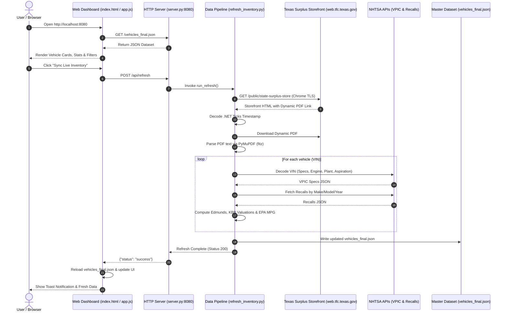

# 🚗 Texas State Surplus Vehicles Inventory Tracker & Dashboard

[](https://www.python.org/)
[](https://developer.mozilla.org/en-US/docs/Web/HTML)
[](https://developer.mozilla.org/en-US/docs/Web/CSS)
[](https://developer.mozilla.org/en-US/docs/Web/JavaScript)
[](https://pymupdf.readthedocs.io/)
[](https://vpic.nhtsa.dot.gov/api/)

An automated, full-stack data pipeline, VIN decoding engine, valuation suite, and interactive web dashboard for real-time monitoring and analysis of vehicle inventory at the **Texas State Surplus Store** (Texas Facilities Commission - TFC).

---

## 📌 Project Overview

The Texas State Surplus Store (located at **6506 Bolm Rd, Austin, TX 78721**) sells government surplus fleet vehicles—including police pursuit interceptors, pickup trucks, SUVs, and passenger cars—to the public. 

However, tracking this inventory poses several technical challenges:
- **Akamai Edge WAF Protection**: Standard HTTP requests (`requests`, `urllib`, `curl`) receive HTTP 403 Forbidden responses.
- **Dynamic PDF URL Paths**: The inventory list PDF is published behind dynamic `.NET` tick document URLs that change with every update.
- **Raw Data Limitations**: Official PDF listings include only basic details (Asset Number, raw description, VIN, Mileage, and Price) without engine specs, safety recall histories, market valuations, or photos.

### How This Application Solves It
1. **Chrome TLS Impersonation (`curl_cffi`)**: Emulates browser TLS fingerprints to bypass Akamai WAF protection seamlessly.
2. **Dynamic Link Resolution & Timestamp Decoding**: Parses the storefront HTML to locate dynamic document links and decodes `.NET 64-bit tick timestamps` into exact publication dates/times in US Central Time.
3. **Structured PDF Parsing (`PyMuPDF`)**: Extracts and validates vehicle attributes across multi-page document layouts.
4. **Multi-Source Data Enrichment**:
   - **NHTSA VPIC API**: Decodes VINs for displacement, cylinders, horsepower, drivetrain, assembly plant location, and engine aspiration (*Naturally Aspirated*, *Turbocharged*, *Supercharged*).
   - **NHTSA Recalls API**: Fetches active safety recall campaigns, defect summaries, risk consequences, and manufacturer remedies.
   - **Edmunds & KBB Valuation Engine**: Maps expert reviews, pros/cons, ratings, Kelley Blue Book (KBB) fair market purchase ranges, suggested retail, and estimated savings vs. surplus prices.
   - **EPA Fuel Economy**: Pulls City, Highway, and Combined MPG estimates.
5. **Stock Photo Engine & SVG Generator**: Serves studio photography for standard models and dynamically renders custom SVG vector illustrations for any unrecognized newly listed vehicle models.
6. **Glassmorphic Web Dashboard & Live Sync Server**: A modern dark-mode dashboard with search, multi-select filters, sorting, stat counters, modal spec drawers, and a built-in HTTP server (`server.py`) supporting live `POST /api/refresh` synchronization.

---

## 🏗️ System Architecture



---

## ✨ Features

- **🛡️ Akamai WAF Bypass**: Uses Chrome TLS fingerprinting via `curl_cffi` to bypass Akamai WAF rules without headless browsers or proxy services.
- **⏱️ .NET Tick Timestamp Decoding**: Converts 64-bit .NET timestamps in document URIs (e.g., `638843916000000000`) into human-readable Central Standard/Daylight Time strings.
- **⚡ Engine Aspiration Breakdown**: Categorizes powertrain configurations (e.g. *Naturally Aspirated* vs. *3.5L EcoBoost Twin-Turbocharged*).
- **⚠️ NHTSA Safety Recalls**: Displays official safety recall notices including campaign numbers, affected components, defect details, and dealer remedies.
- **📊 Edmunds & KBB Valuation Engine**: Calculates KBB Fair Purchase Price, Suggested Retail, Private Party value, price range, and savings percentage compared to Texas Surplus pricing.
- **⛽ EPA Fuel Economy Ratings**: Computes City, Highway, and Combined MPG with highest-efficiency sorting capabilities.
- **🎨 Stock Photo & SVG Illustration Engine**: Bundles high-resolution vehicle stock photography and generates dynamic SVG illustrations for newly encountered vehicle models.
- **💻 Responsive Web Dashboard**:
  - Live fuzzy search across Make, Model, VIN, Asset #, and Engine Aspiration.
  - Multi-select filters by Make (Chevrolet, Ford, RAM, Dodge) and Body Style (SUV, Pickup, Sedan).
  - Flexible sorting options: Price (Low/High), Mileage (Low/High), MPG (High), Model Year (Newest).
  - Detailed spec modal drawer with NHTSA recall accordion and valuation metrics.
  - One-click **"Sync Live Inventory"** button.

---

## 📂 Directory Structure & Sitemap

```
/Users/slemay/Work/Surplus/
├── public/                            # Static Web Application Assets
│   ├── index.html                     # Dashboard HTML structure
│   ├── css/
│   │   └── styles.css                 # Dark-mode glassmorphic CSS design system
│   ├── js/
│   │   └── app.js                     # Frontend filter, sort, search & modal UI logic
│   ├── images/                        # Stock vehicle photos & generated SVG illustrations
│   │   ├── chevrolet_silverado.jpg
│   │   ├── chevrolet_tahoe.jpg
│   │   ├── chevy_impala.jpg
│   │   ├── dodge_journey.jpg
│   │   ├── ford_explorer.jpg
│   │   ├── ford_taurus.jpg
│   │   └── ram_1500.jpg
│   └── data/
│       └── vehicles_final.json        # Master enriched vehicle inventory dataset
├── src/                               # Backend Python Source Modules
│   ├── server.py                      # Local HTTP server & API proxy implementation
│   ├── refresh_inventory.py          # Main automated scraping, parsing & enrichment pipeline
│   └── pull_surplus_vehicles.py      # Scraping helper module
├── data/                              # Data Storage & PDF Documents
│   ├── Texas_State_Surplus_Vehicles.pdf # Downloaded official inventory PDF
│   └── vehicles_final.json            # Data backup
├── scripts/                           # Shell Automation Scripts
│   └── refresh.sh                     # Pipeline execution wrapper script
├── .agents/skills/
│   └── texas-surplus-vehicles/
│       └── SKILL.md                   # Reusable autonomous agent skill definition
├── server.py                          # Root entrypoint wrapper
├── refresh.sh                         # Root shell wrapper
├── requirements.txt                   # Python package dependencies
├── DESIGN.md                          # System design document
├── README.md                          # Project documentation
└── venv/                              # Python virtual environment
```

---

## 🚀 Quick Start & Installation

### 1. Prerequisites
Ensure Python 3.9+ is installed on your system.

### 2. Environment Setup
Navigate to the project workspace, create a virtual environment, and install dependencies:

```bash
cd /Users/slemay/Work/Surplus

# Create virtual environment
python3 -m venv venv

# Install required Python packages
./venv/bin/pip install curl_cffi beautifulsoup4 pymupdf
```

### 3. Start the Web Dashboard Server
Run `server.py` to start the HTTP server on port 8080:

```bash
./venv/bin/python3 server.py
```

Output:
```
[*] Dashboard Web Server running on http://localhost:8080
```

### 4. Access the Dashboard
Open your web browser and navigate to:
👉 **`http://localhost:8080/index.html`** (or **`http://localhost:8080`**)

---

## 🔄 Refreshing Inventory Data

Vehicle inventory can be refreshed at any time using any of the following **three methods**:

### Method A: Web Dashboard Button (Recommended)
Open **`http://localhost:8080`** in your browser and click the **"Sync Live Inventory"** button in the top navigation bar. This sends a `POST /api/refresh` request to the backend server, re-scrapes the storefront, decodes VINs via NHTSA, updates `vehicles_final.json`, and reloads the UI automatically.

### Method B: Executable Shell Script
Execute the helper shell script from your terminal:

```bash
./refresh.sh
```

### Method C: Python Pipeline Script
Run the enrichment pipeline script directly:

```bash
./venv/bin/python3 refresh_inventory.py
```

---

## 🔌 API Documentation

The server (`server.py`) acts as both a static file server and an API proxy.

### `POST /api/refresh`
Triggers the full scraping, PDF downloading, NHTSA VIN decoding, NHTSA recall fetching, valuation calculation, and JSON dataset update pipeline.

- **Request**: `POST http://localhost:8080/api/refresh`
- **Headers**: `Content-Type: application/json`
- **Response (200 OK)**:
```json
{
  "status": "success",
  "message": "Inventory refreshed successfully!"
}
```
- **Response (500 Internal Server Error)**:
```json
{
  "status": "error",
  "message": "Error description..."
}
```

### Static File Routes
- `GET /` or `GET /index.html` — Main Glassmorphic Dashboard
- `GET /styles.css` — CSS Design System
- `GET /app.js` — Dashboard Logic & Event Handlers
- `GET /vehicles_final.json` — Enriched Inventory Data
- `GET /images/*` — Vehicle Stock Photos & SVG Illustrations

---

## 🤖 Reusable Agent Skill

This project includes a pre-packaged autonomous agent skill configured for Google Antigravity (AGY):

- **Skill Location**: [`.agents/skills/texas-surplus-vehicles/SKILL.md`](file:///Users/slemay/Work/Surplus/.agents/skills/texas-surplus-vehicles/SKILL.md)

### Trigger Prompts:
- *"Fetch Texas surplus vehicles"*
- *"Refresh Texas surplus inventory"*
- *"Check vehicle listings at Texas surplus store"*

---

## 🌐 Publishing to GitHub & Enabling GitHub Pages

This project is pre-configured for automated deployment to **GitHub Pages** with scheduled background data synchronization via **GitHub Actions**.

### Step 1: Initialize Git Repository & Commit
Run the following commands in your workspace terminal:

```bash
cd /Users/slemay/Work/Surplus

# Initialize Git
git init

# Add all files (respecting .gitignore)
git add .

# Create initial commit
git commit -m "feat: initial commit for Texas Surplus Vehicles application"
```

### Step 2: Create Remote Repository on GitHub
1. Go to [GitHub - New Repository](https://github.com/new).
2. Enter Repository Name: `texas-surplus-vehicles` (or your preferred name).
3. Set visibility to **Public** (required for free GitHub Pages).
4. Do **NOT** initialize with a README, .gitignore, or license (already included).
5. Copy and run the remote commands from GitHub:

```bash
git remote add origin https://github.com/<your-username>/texas-surplus-vehicles.git
git branch -M main
git push -u origin main
```

### Step 3: Enable GitHub Pages
1. Go to your repository settings on GitHub: `https://github.com/<your-username>/texas-surplus-vehicles/settings/pages`
2. Under **Build and deployment** -> **Source**: Select **GitHub Actions**.
3. Done! The workflow `.github/workflows/deploy.yml` will automatically:
   - Host your dashboard live at: `https://<your-username>.github.io/texas-surplus-vehicles/`
   - Re-run `refresh_inventory.py` every **6 hours** via GitHub Actions to fetch fresh PDFs, decode VINs, and update the live site automatically!

---

## 📄 Data Sources & Attribution

- **Inventory Source**: [Texas Facilities Commission (TFC) State Surplus Store](https://web.tfc.texas.gov/public/state-surplus-store)
- **VIN Specifications**: [NHTSA VPIC API](https://vpic.nhtsa.dot.gov/api/)
- **Safety Recalls**: [NHTSA Safety Recalls API](https://api.nhtsa.gov/recalls/recallsByVehicle)
- **Fuel Economy**: [U.S. Department of Energy / EPA FuelEconomy.gov](https://www.fueleconomy.gov/)
- **Valuation Data**: Edmunds & Kelley Blue Book (KBB) Market Benchmarks

